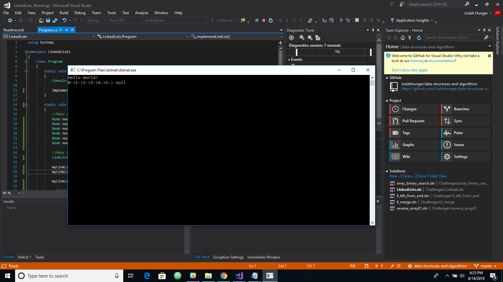

# Linked List

## Challenge
- Linked Lists implement a Singly Linked list.
- Make classes of Linked Lists and Node.
- Be able to Add a node to front, back of linked list.
- Be able to Add a node before or after a node.
- Be able to find a node 
- Be able to print out the nodes to console.

## Solution
- Add to front of LinkedList myLinkList with initail value node3 output: node3-->null
- myLinkList.Add(node2) : output node2--node3-->null
- myLinkList.Add(node0) : output node0--node2--node3--> because add will add it to begining of list.

- AddAfter is add after a node:
- myLinkList.AddAfter(node4, node3) : output node0--node2--node3--node4-->null

- AddBefore a node:
- myLinkList.AddBefore(node1, node2) : output node0--node1--node2--node3--node4-->null

- AddLast a node to end:
- myLinkList.AddLast(node5) : output node0--node1--node2--node3--node4--node5-->null

- [x] Do all your work in a public repository called Data-structures-and-algorithms
- [x] Create a branch in your repository called LinkedList
- [x] On your branch, create a file called LinkedList, with the proper file extension for your programming language
- [x] Include any language-specific configuration files required for this challenge to become an individual component, module, library, etc.
- [x] Linked Lists implement a Singly Linked list.
- [x] Make classes of Linked Lists and Node.
- [x] Be able to Add a node to front, back of linked list.
- [x] Be able to Add a node before or after a node.
- [x] Be able to find a node 
- [x] Be able to print out the nodes to console.
