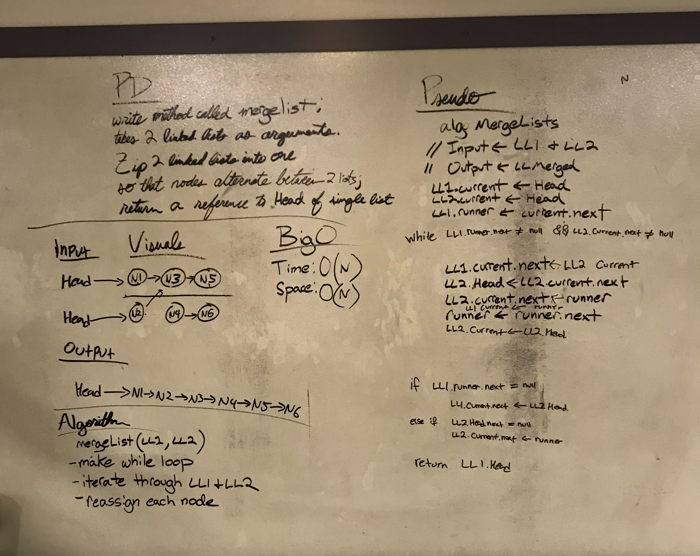

# LL Merge

## Challenge
-Write a function called mergeLists which takes two linked lists as arguments. 
-Zip the two linked lists together into one so that the nodes alternate between the two lists and return a reference to the head of the single list.

## Solution


- [x] Do all your work in a public repository called data-structures-and-algorithms
- [x] Create a branch in your repository called ll_merge.
- [x] On your branch, create a file called ll_merge, with the proper file extension for your programming language
- [x] Include any language-specific configuration files required for this challenge to become an individual component, module, library, etc.
- [x] Write a function called mergeLists which takes two linked lists as arguments.
- [x] Zip the two linked lists together into one so that the nodes alternate between the two lists and return a reference to the head of the single list.
- [x] Take a photo of your completed whiteboard, matching the example whiteboard layout.
- [x] Copy your photo into an /assets directory in your repo
- [x] Give the image file the same name as the branch you are working on
- [x] Embed the image in your README.md documentation
- [x] Create a pull request from your branch to your master branch
- [x] In your open pull request, leave as a comment a checklist of the specifications and tasks above, with the actual steps that you completed checked off
- [x] Copy the link to your open pull request and paste it into the corresponding Canvas assignment
- [x] Leave a description of how long this assignment took you in the comments box
- [x] Add any additional comments you like about your process or any difficulties you may have had with the assignment
- [x] Merge your branch into master, and delete your branch (don't worry, the PR link will still work)```
